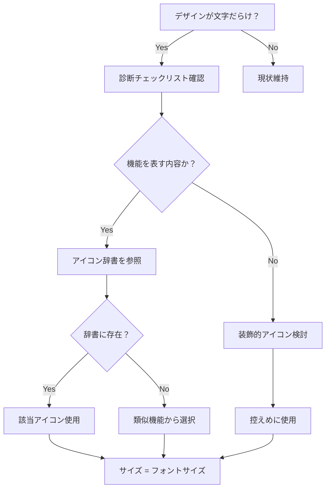

# アイコン活用による視覚的改善システム

## 🎯 基本原則

### 最重要ルール
1. **文字と横並び時：アイコンサイズ = フォントサイズ**
2. **プロジェクト全体での一貫性優先**（同じ機能 = 同じアイコン）
3. **機能的意味 > 装飾的使用**

### 基本コンセプト
アイコンは「文字だらけ」「さみしいデザイン」を解決する戦略的ツール。単なる装飾ではなく、情報の種類を視覚的に区別し、ユーザーの認知負荷を軽減する「視覚言語」として機能する。

## 📖 プロジェクト共通アイコン辞書

### 基本機能アイコン
```
ナビゲーション系：
├─ home → house
├─ menu → menu / hamburger  
├─ back → arrow-left
├─ forward → arrow-right
└─ close → x

アクション系：
├─ search → search
├─ filter → filter
├─ sort → sort / arrow-up-down
├─ refresh → refresh-cw
└─ download → download

設定・管理系：
├─ settings → settings / gear
├─ user → user / user-circle
├─ admin → shield / lock
├─ edit → edit / pencil
└─ delete → trash-2

データ・分析系：
├─ dashboard → layout-dashboard
├─ analytics → bar-chart / line-chart
├─ report → file-text
├─ calendar → calendar
└─ time → clock

コミュニケーション系：
├─ message → message-circle
├─ notification → bell
├─ share → share-2
├─ like → heart
└─ comment → message-square
```

### ステータスアイコン
```
基本状態：
├─ success → check-circle
├─ error → x-circle / alert-circle
├─ warning → alert-triangle
├─ info → info
└─ loading → loader-2 (+ rotate animation)

プロセス状態：
├─ pending → clock
├─ in-progress → loader-2
├─ completed → check-circle
├─ failed → x-circle
└─ paused → pause-circle
```

## 📐 使用パターン

### A. アイコン単体での使用
```css
/* ナビゲーション・ツールバー */
.nav-icon {
  width: 24px;
  height: 24px;
  color: var(--color-semantic-text-middle-light);
}

/* 主要アクション（大） */
.hero-icon {
  width: 48px;
  height: 48px;
  color: var(--color-semantic-primary-600-light);
}

/* 補助アクション（小） */
.utility-icon {
  width: 16px;
  height: 16px;
  color: var(--color-semantic-text-low-light);
}
```

### B. テキストとセットでの使用
```css
/* 見出し + アイコン */
.heading-with-icon {
  display: inline-flex;
  align-items: center;
  gap: 8px;
}
.heading-with-icon .icon {
  width: 1em;  /* フォントサイズと連動 */
  height: 1em;
}

/* 例：h2（24px）には24pxアイコン */
h2.heading-with-icon .icon {
  width: var(--font-size-24);
  height: var(--font-size-24);
}

/* インラインテキスト + アイコン */
.text-with-icon {
  display: inline-flex;
  align-items: center;
  gap: 4px;
}
.text-with-icon .icon {
  width: 1em;
  height: 1em;
  vertical-align: middle;
}
```

## 🔍 「文字だらけ」の診断と対策

### 診断チェックリスト
```
□ 3行以上の連続テキストが3箇所以上ある
□ リスト項目が5個以上あるのに中黒（・）や番号のみ
□ 見出しと本文だけで構成されている
□ 機能説明が全てテキストのみ
□ ステータス表示がテキストのみ
□ 視覚的なアクセントがない（色変更のみ）
```

### 改善パターン

#### パターン1：構造的アイコン追加
```html
<!-- Before -->
<div class="status">処理中: 15件のデータを分析しています</div>

<!-- After -->
<div class="status">
  <i data-lucide="loader-2" class="animate-spin"></i>
  処理中: 15件のデータを分析しています
</div>
```

#### パターン2：リスト項目の視覚化
```html
<!-- Before -->
<ul>
  <li>高速処理</li>
  <li>自動保存</li>
  <li>共有機能</li>
</ul>

<!-- After -->
<ul class="feature-list">
  <li><i data-lucide="zap"></i> 高速処理</li>
  <li><i data-lucide="save"></i> 自動保存</li>
  <li><i data-lucide="share-2"></i> 共有機能</li>
</ul>
```

#### パターン3：セクション見出しの強化
```html
<!-- Before -->
<h3>設定</h3>

<!-- After -->
<h3 class="heading-with-icon">
  <i data-lucide="settings"></i>
  設定
</h3>
```

## 📊 適用量の目安

### 基本ガイドライン
- **1画面あたり**：5-8種類のアイコン（多すぎると散漫）
- **同一アイコンの繰り返し**：最大3-4個まで
- **アイコン密度**：視覚的要素の30-40%程度

### コンテキスト別の目安
```
ダッシュボード：
├─ 各指標に1アイコン
├─ ナビゲーションに3-5アイコン
└─ 合計：8-12個

フォーム画面：
├─ 各入力欄に0-1アイコン（必要に応じて）
├─ アクションボタンに1-2アイコン
└─ 合計：3-5個

一覧画面：
├─ 各行のステータスに1アイコン
├─ アクションボタンに2-3アイコン
└─ 合計：4-6種類
```

## 🚀 実装時の判断フロー



## ⚠️ NGパターン

### 避けるべき実装
```css
/* ❌ サイズ不一致 */
.bad-example {
  font-size: 16px;
}
.bad-example .icon {
  width: 24px;  /* フォントと不一致 */
  height: 24px;
}

/* ❌ 過度な装飾 */
.over-decorated {
  /* すべての要素にアイコン → 視覚的ノイズ */
}

/* ❌ 一貫性なし */
/* 同じ「設定」機能で異なるアイコン使用 */
```

## 💡 AIの自動適用指針

### プロンプト検知キーワード
```javascript
const needsIconEnhancement = (userInput) => {
  const triggers = [
    "さみしい", "文字だらけ", "テキストばかり",
    "視覚的に", "もっと見やすく", "アイコン",
    "単調", "メリハリ", "わかりやすく"
  ];
  
  return triggers.some(keyword => userInput.includes(keyword));
};
```

### 自動提案の優先順位
1. **機能アイコン**：まず共通辞書から機能に合うアイコンを選択
2. **ステータス表示**：状態を表す箇所にステータスアイコン追加
3. **ナビゲーション**：メニュー項目にアイコン追加
4. **見出し補強**：主要セクションの見出しにアイコン
5. **装飾的使用**：最後の手段として、視覚的アクセント

## 📝 チェックリスト

### アイコン追加前の確認
- [ ] 本当にアイコンが必要か？（文字だけで十分な場合もある）
- [ ] プロジェクトの他の場所で同じ機能が使われているか？
- [ ] 使う場合、共通辞書に該当アイコンはあるか？
- [ ] テキストと並ぶ場合、サイズは同じに設定したか？
- [ ] アイコンの意味は直感的に理解できるか？
- [ ] 適用量は適切か？（多すぎないか）